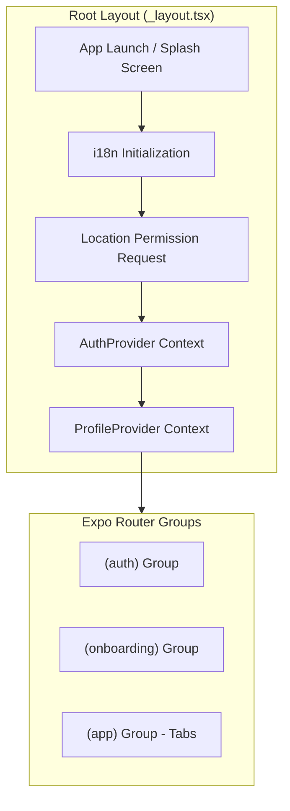
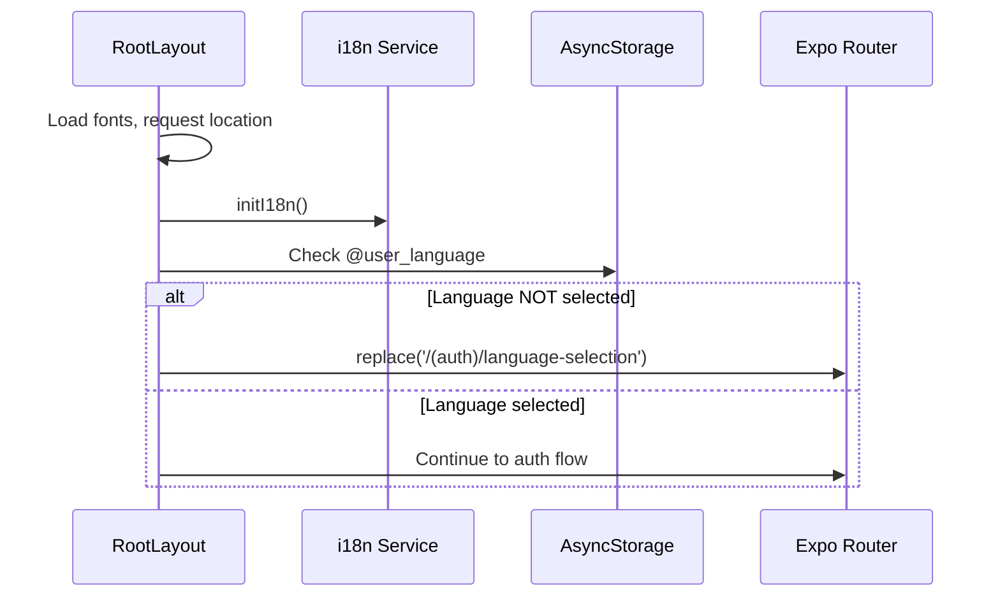
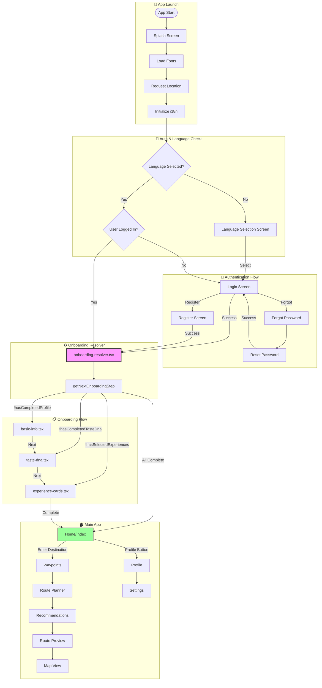
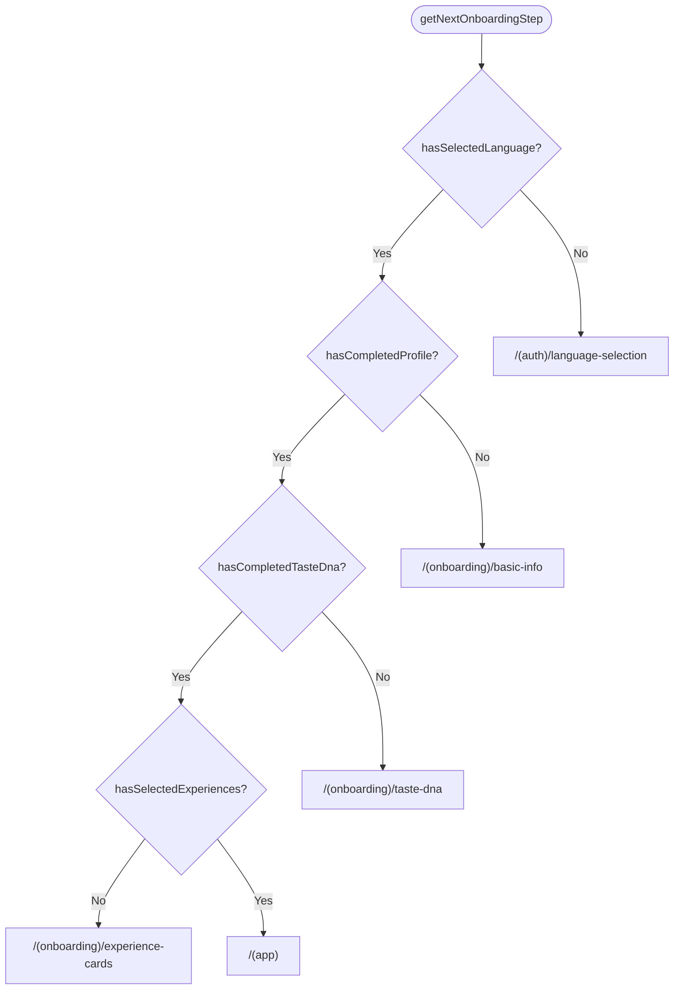
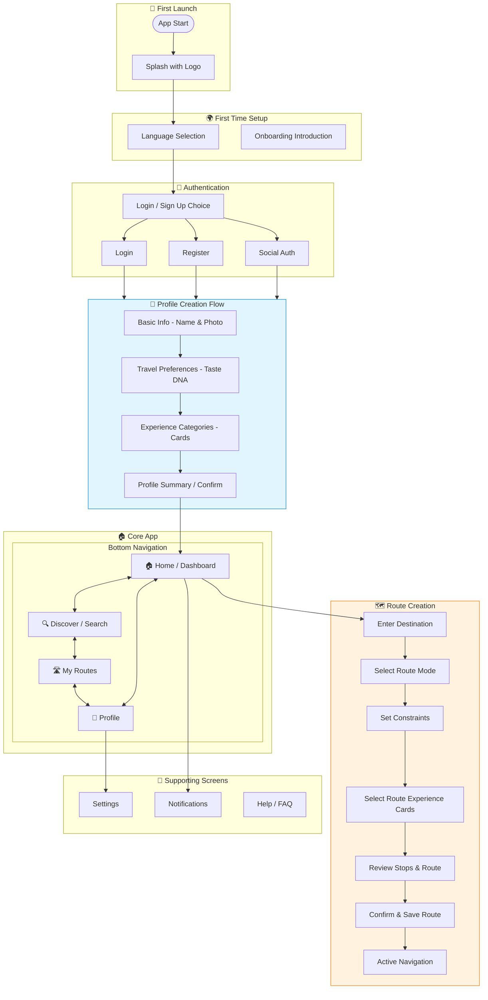
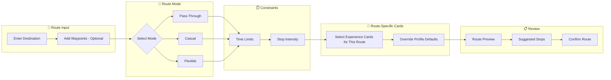
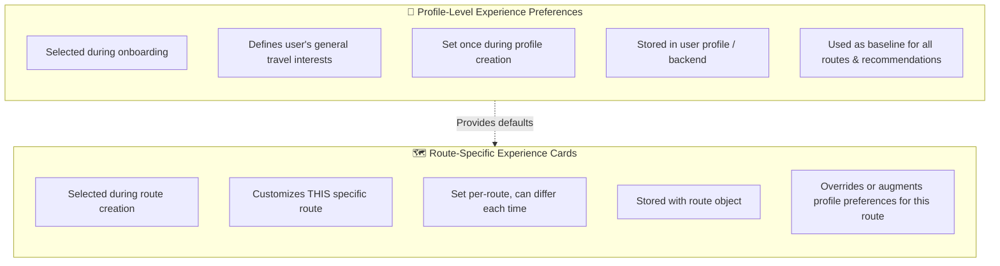

# Repathly Screen Flow Analysis

> **Document Purpose**: Single source of truth for screen navigation, onboarding logic, and flow architecture in the Repathly mobile app.

---

## Table of Contents
1. [Current Screen Flow (AS-IS)](#1-current-screen-flow-as-is)
2. [Ideal/Suggested Screen Flow (TO-BE)](#2-idealsuggested-screen-flow-to-be)
3. [Experience Cards Clarity](#3-experience-cards-clarity)
4. [Issues & Recommendations](#4-issues--recommendations)

---

# 1. Current Screen Flow (AS-IS)

## Architecture Overview



## App Initialization Sequence



---

## Current Screen Inventory

### Route Group: `(auth)`

| Screen | File | Purpose | Status |
|--------|------|---------|--------|
| `language-selection` | [language-selection.tsx](file:///d:/Repathly/mobile/app/(auth)/language-selection.tsx) | First-time language selection (EN/TR) | ✅ Working |
| `login` | [login.tsx](file:///d:/Repathly/mobile/app/(auth)/login.tsx) | Email/password login + social login stubs | ✅ Working |
| `register` | [register.tsx](file:///d:/Repathly/mobile/app/(auth)/register.tsx) | Email/password registration | ✅ Working |
| `forgot-password` | [forgot-password.tsx](file:///d:/Repathly/mobile/app/(auth)/forgot-password.tsx) | Password reset request | ✅ Working |
| `reset-password` | [reset-password.tsx](file:///d:/Repathly/mobile/app/(auth)/reset-password.tsx) | Password reset with token | ✅ Working |
| `onboarding-resolver` | [onboarding-resolver.tsx](file:///d:/Repathly/mobile/app/(auth)/onboarding-resolver.tsx) | Determines next onboarding step | ✅ Working |

### Route Group: `(onboarding)`

| Screen | File | Purpose | Status |
|--------|------|---------|--------|
| `basic-info` | [basic-info.tsx](file:///d:/Repathly/mobile/app/(onboarding)/basic-info.tsx) | Name, photo, bio collection | ⚠️ Minimal (no photo upload) |
| `taste-dna` | [taste-dna.tsx](file:///d:/Repathly/mobile/app/(onboarding)/taste-dna.tsx) | Travel preferences (style, detour, budget, group, stops) | ✅ Working |
| `experience-cards` | [experience-cards.tsx](file:///d:/Repathly/mobile/app/(onboarding)/experience-cards.tsx) | Profile-level interest selection (min 4 cards) | ✅ Working |

### Route Group: `(app)` - Main App Tabs

| Screen | File | Purpose | Tab Visible | Status |
|--------|------|---------|-------------|--------|
| `index` (Home) | [index.tsx](file:///d:/Repathly/mobile/app/(app)/index.tsx) | Destination input, route creation start | ❌ Tab bar disabled | ✅ Working |
| `interests` | [interests.tsx](file:///d:/Repathly/mobile/app/(app)/interests.tsx) | Interest notifications/feed | ❌ Tab bar disabled | ✅ Exists |
| `add` | [add.tsx](file:///d:/Repathly/mobile/app/(app)/add.tsx) | Add new content (stub) | ❌ Tab bar disabled | ⚠️ Minimal |
| `favorites` | [favorites.tsx](file:///d:/Repathly/mobile/app/(app)/favorites.tsx) | Saved favorites | ❌ Tab bar disabled | ⚠️ Minimal |
| `map` | [map.tsx](file:///d:/Repathly/mobile/app/(app)/map.tsx) | Full map view | ❌ Tab bar disabled | ✅ Working |
| `recommendations` | Hidden | AI recommendations | Hidden | ✅ Working |
| `route-planner` | Hidden | Route configuration | Hidden | ✅ Working |
| `route-preview` | Hidden | Route preview before confirm | Hidden | ✅ Working |
| `waypoints` | Hidden | Waypoint selection | Hidden | ✅ Working |
| `fullscreen-map` | Hidden | Fullscreen map mode | Hidden | ✅ Working |
| `profile` | Hidden | User's own profile view | Hidden | ✅ Working |
| `user-profile` | Hidden | Other user's profile | Hidden | ✅ Working |
| `chats` | Hidden | Chat list | Hidden | ✅ Exists |
| `chat` | Hidden | Individual chat | Hidden | ✅ Exists |
| `settings` | Hidden | App settings | Hidden | ✅ Working |

---

## Current Navigation Flow Diagram



---

## Onboarding State Management

The onboarding flow is managed by [onboardingManager.ts](file:///d:/Repathly/mobile/utils/onboardingManager.ts):

```typescript
// AsyncStorage Keys
const STORAGE_KEYS = {
    HAS_SELECTED_LANGUAGE: '@onboarding_language_selected',
    HAS_COMPLETED_PROFILE: '@onboarding_profile_completed',
    HAS_COMPLETED_TASTE_DNA: '@onboarding_taste_dna_completed',
    HAS_SELECTED_EXPERIENCES: '@onboarding_experiences_selected',
};
```

### State Resolution Logic



---

## ⚠️ Current Issues & Broken Flows

### Issue 1: Tab Bar Disabled
- **Location**: [(app)/_layout.tsx](file:///d:/Repathly/mobile/app/(app)/_layout.tsx) line 21
- **Problem**: `CustomTabBar` returns `null`, making bottom navigation invisible
- **Impact**: Users can only navigate via explicit screen-to-screen navigation

### Issue 2: Social Login Bypasses Onboarding
- **Location**: [register.tsx](file:///d:/Repathly/mobile/app/(auth)/register.tsx) lines 86-94
- **Problem**: Google/Apple sign-up directly routes to `/(app)` without going through `onboarding-resolver`
- **Impact**: Profile creation, Taste DNA, and Experience Cards are all skipped

### Issue 3: Profile Screen Uses Dummy Data
- **Location**: [profile.tsx](file:///d:/Repathly/mobile/app/(app)/profile.tsx) lines 96-115
- **Problem**: `favoriteExperiences` and `recentReviews` are hardcoded mock data
- **Impact**: Profile doesn't reflect real user data

### Issue 4: Basic Info Doesn't Save Bio or Photo
- **Location**: [basic-info.tsx](file:///d:/Repathly/mobile/app/(onboarding)/basic-info.tsx) lines 38-41
- **Problem**: Only `name` and `hasCompletedProfile` are saved; `bio` and photo are discarded
- **Impact**: User's bio is not persisted

### Issue 5: Missing Profile Edit Functionality
- **Location**: [profile.tsx](file:///d:/Repathly/mobile/app/(app)/profile.tsx) lines 121-123
- **Problem**: Edit profile shows an alert placeholder, no actual edit screen exists

---

# 2. Ideal/Suggested Screen Flow (TO-BE)

## Proposed Navigation Architecture



---

## Proposed Onboarding & Profile Creation

### Step 1: Language Selection
- **Screen**: Language Selection
- **Purpose**: EN / TR choice (affects entire app)
- **Persists**: `@user_language` in AsyncStorage

### Step 2: Authentication
- **Screen**: Auth Choice → Login / Register / Social
- **Purpose**: Create or verify user account
- **Persists**: Token, user object in SecureStore

### Step 3: Profile Creation

#### 3a. Basic Info Screen
| Field | Required | Current State | Proposed |
|-------|----------|---------------|----------|
| Name | ✅ | Working | Keep |
| Profile Photo | ❌ | UI only, not saved | Implement upload |
| Bio | ❌ | UI only, not saved | Persist to backend |

#### 3b. Taste DNA Screen (Travel Preferences)
| Preference | Options | Purpose |
|------------|---------|---------|
| Travel Style | Fast ↔ Experience-first | Route prioritization |
| Detour Tolerance | Low / Medium / High | Stop selection radius |
| Budget Sensitivity | Budget / Moderate / Premium | Place filtering |
| Group Type | Solo / Couple / Friends / Family | Context awareness |
| Stop Intensity | Minimal / Moderate / Maximum | Stop frequency |

#### 3c. Experience Cards (Profile-Level)
- **Minimum**: 4 cards required
- **Categories**: Food & Dining, Activities, Lifestyle, Special Interest
- **Purpose**: Baseline profile preferences for personalization

### Step 4: Profile Summary (NEW)
- Show collected data
- Allow going back to edit
- Confirm to enter app

---

## Proposed Route Creation Flow



### Route Modes Explained

| Mode | Time Priority | Experience Priority | Use Case |
|------|---------------|---------------------|----------|
| **Pass-Through** | High | Low | "I need to get there fast, show me quick stops only" |
| **Casual** | Medium | Medium | "Balance time and experience, moderate detours OK" |
| **Flexible** | Low | High | "The journey is the destination, maximize experiences" |

---

## Proposed Bottom Navigation

| Tab | Icon | Primary Screen | Description |
|-----|------|----------------|-------------|
| **Home** | 🏠 | Dashboard | Quick route creation, recent routes, personalized suggestions |
| **Discover** | 🔍 | Search/Explore | Browse places, experiences, community routes |
| **My Routes** | 🛣️ | Saved Routes | Saved, in-progress, and completed routes |
| **Profile** | 👤 | Profile | User profile, settings, preferences |

---

# 3. Experience Cards Clarity

## Two Contexts for Experience Cards



## When Each is Used

| Context | Where in Flow | Data Source | Override Behavior |
|---------|---------------|-------------|-------------------|
| **Profile-Level** | Onboarding → Experience Cards | User's saved preferences | Acts as global default |
| **Route-Level** | Route Creation → Step 4 | User's selection for this specific route | Overrides profile for this route only |

## Example Scenario

> **User Profile**: Loves coffee shops, local food, scenic viewpoints
>
> **Route A (Business trip)**: User selects only "Quick Stops" and "Coffee" → Overrides full profile
>
> **Route B (Weekend getaway)**: User keeps profile defaults + adds "Hiking" → Augments profile

---

# 4. Issues & Recommendations

## 🔴 Fix Immediately (Critical)

### 1. Enable Tab Bar Navigation
- **File**: [(app)/_layout.tsx](file:///d:/Repathly/mobile/app/(app)/_layout.tsx)
- **Action**: Remove `return null` from `CustomTabBar` or implement proper tabs
- **Why**: Users have no way to navigate the app currently

### 2. Fix Social Login Bypass
- **File**: [register.tsx](file:///d:/Repathly/mobile/app/(auth)/register.tsx)
- **Action**: Change `router.replace('/(app)')` to `router.replace('/(auth)/onboarding-resolver')`
- **Why**: Social login users skip entire onboarding, breaking personalization

### 3. Persist Bio in Basic Info
- **File**: [basic-info.tsx](file:///d:/Repathly/mobile/app/(onboarding)/basic-info.tsx)
- **Action**: Include `bio` in `updateUser()` call
- **Why**: Users fill out bio but it's never saved

## 🟡 Add Soon (Important)

### 4. Implement Profile Photo Upload
- **Files**: `basic-info.tsx`, `profile.ts` API, backend endpoint
- **Action**: Add image picker, upload endpoint, persist URL
- **Why**: Photo is core to profile identity

### 5. Add Profile Edit Screen
- **Action**: Create `edit-profile.tsx` screen
- **Why**: Users currently cannot update their profile after onboarding

### 6. Create Route-Level Experience Card Selection
- **Where**: During route creation (new screen)
- **Why**: Currently no way to customize experience cards per-route

## 🟢 Add Later (Enhancement)

### 7. Add Profile Summary Confirmation Screen
- **Where**: After experience cards, before home
- **Why**: Let users review before entering app

### 8. Implement Discover/Search Tab
- **Why**: Core pillar per CLAUDE.md vision

### 9. Add My Routes Tab
- **Why**: Central access to saved routes

---

## File Reference Summary

| Category | Key Files |
|----------|-----------|
| **Root Navigation** | `app/_layout.tsx`, `app/index.tsx` |
| **Auth Flow** | `app/(auth)/*.tsx`, `contexts/AuthContext.tsx` |
| **Onboarding** | `app/(onboarding)/*.tsx`, `utils/onboardingManager.ts` |
| **Main App** | `app/(app)/_layout.tsx`, `app/(app)/index.tsx` |
| **Profile** | `app/(app)/profile.tsx`, `contexts/ProfileContext.tsx` |
| **API Services** | `services/api/auth.ts`, `services/api/profile.ts`, `services/api/experienceCards.ts` |

---

*Generated: 2026-02-07 | Based on codebase analysis of Repathly mobile app*
