# Repathly Screen Flow & Mockups Document

> **Version**: 1.0  
> **Date**: February 7, 2025  
> **Purpose**: Product Blueprint | Design Handoff | Development Reference

---

## Table of Contents

1. [Screen Flow Overview](#1-screen-flow-overview)
2. [Current Screens (1-16)](#2-current-screens)
3. [Future/Planned Screens (17-21)](#3-futureplanned-screens)
4. [Screen Relationship Matrix](#4-screen-relationship-matrix)
5. [Implementation Status](#5-implementation-status)

---

# 1. Screen Flow Overview

## Complete User Journey

```
┌─────────────────────────────────────────────────────────────────────────────┐
│                           FIRST-TIME USER FLOW                               │
├─────────────────────────────────────────────────────────────────────────────┤
│                                                                              │
│   Screen 1          Screen 2           Screen 3/4        Screen 5           │
│   ┌───────┐         ┌───────┐         ┌───────┐         ┌───────┐          │
│   │Splash │────────▶│Language│────────▶│Login/ │────────▶│Resolver│         │
│   │       │         │Select  │         │Register│        │        │          │
│   └───────┘         └───────┘         └───────┘         └───────┘          │
│                                                              │               │
│                          ┌───────────────────────────────────┘               │
│                          ▼                                                   │
│   Screen 6          Screen 7           Screen 8          Screen 21*         │
│   ┌───────┐         ┌───────┐         ┌───────┐         ┌───────┐          │
│   │Basic  │────────▶│Taste  │────────▶│Exp.   │────────▶│Summary │         │
│   │Info   │         │DNA    │         │Cards  │         │[FUTURE]│          │
│   └───────┘         └───────┘         └───────┘         └───────┘          │
│                                                              │               │
│                                                              ▼               │
│                                            ┌─────────────────────────────┐   │
│                                            │     MAIN APP (Tabs*)        │   │
│                                            └─────────────────────────────┘   │
│                                                                              │
└─────────────────────────────────────────────────────────────────────────────┘

┌─────────────────────────────────────────────────────────────────────────────┐
│                           MAIN APP FLOW                                      │
├─────────────────────────────────────────────────────────────────────────────┤
│                                                                              │
│   Screen 9          Screen 10          Screen 11         Screen 12          │
│   ┌───────┐         ┌───────┐         ┌───────┐         ┌───────┐          │
│   │ Home  │────────▶│Waypts │────────▶│Route  │────────▶│Recom-  │         │
│   │       │         │       │         │Planner│         │mend.   │          │
│   └───────┘         └───────┘         └───────┘         └───────┘          │
│       │                                                      │               │
│       │                     ┌────────────────────────────────┘               │
│       │                     ▼                                                │
│       │             Screen 13         Screen 14                              │
│       │             ┌───────┐         ┌───────┐                              │
│       │             │Route  │────────▶│ Map   │                              │
│       │             │Preview│         │       │                              │
│       │             └───────┘         └───────┘                              │
│       │                                                                      │
│       ▼                                                                      │
│   Screen 15         Screen 16                                                │
│   ┌───────┐         ┌───────┐                                                │
│   │Profile│────────▶│Settings│                                               │
│   │       │         │       │                                                │
│   └───────┘         └───────┘                                                │
│                                                                              │
└─────────────────────────────────────────────────────────────────────────────┘

* = Tab bar currently disabled in implementation
```

## Flow Logic Summary

| Stage | Screens | Condition | Mandatory |
|-------|---------|-----------|-----------|
| **Launch** | 1 | Always shown | ✅ |
| **Language** | 2 | First launch only | ✅ |
| **Auth** | 3, 4 | User not logged in | ✅ |
| **Onboarding** | 5, 6, 7, 8 | Profile incomplete | ✅ |
| **Main App** | 9-16 | Authenticated + complete | ✅ |
| **Future** | 17-21 | Planned | ❌ |

---

# 2. Current Screens

## Screen 1: Splash Screen
**Status**: ✅ CURRENT  
**Purpose**: App initialization, branding, loading state  
**Transition**: Auto → Screen 2 (first launch) or Screen 9 (returning user)

**Key Elements**:
- App logo (centered)
- App name "Repathly"
- Loading indicator
- Background image/gradient

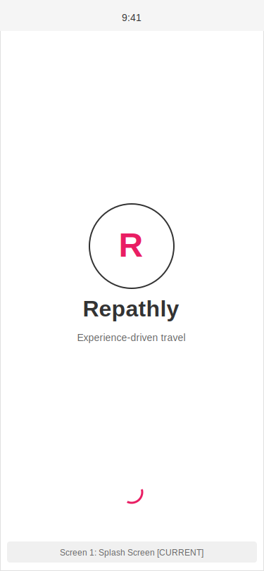

---

## Screen 2: Language Selection
**Status**: ✅ CURRENT  
**Purpose**: Set app language (Turkish/English)  
**Transition**: → Screen 3 (Login)

**Key Elements**:
- App branding
- Language title (bilingual)
- Two language cards: 🇹🇷 Türkçe, 🇬🇧 English
- No back button (first screen after splash)

**Persistence**: Saves to `@user_language` in AsyncStorage

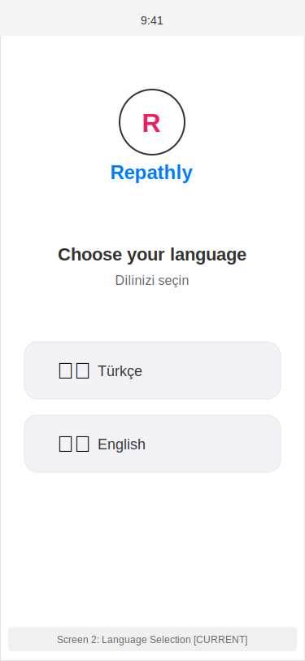

---

## Screen 3: Login
**Status**: ✅ CURRENT  
**Purpose**: User authentication  
**Transitions**:  
- → Screen 4 (Register link)
- → Screen 5 (Onboarding Resolver on success)
- → Forgot Password flow

**Key Elements**:
- Logo + branding
- Email input
- Password input (with visibility toggle)
- "Forgot Password?" link
- Login button
- Social login buttons (Google, Apple)
- Register link

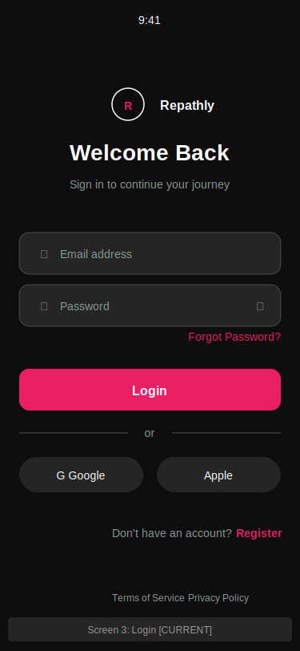

---

## Screen 4: Register
**Status**: ✅ CURRENT  
**Purpose**: New user account creation  
**Transitions**:  
- → Screen 5 (Onboarding Resolver on success)
- → Screen 3 (Login link)

**Key Elements**:
- Back button
- Title + subtitle
- Name input
- Email input
- Password input
- Confirm password input
- Register button
- Social signup buttons
- Login link

**⚠️ Issue**: Social signup bypasses onboarding flow!

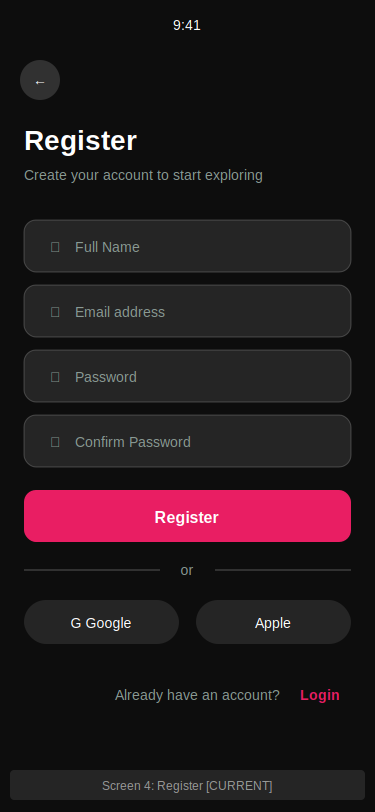

---

## Screen 5: Onboarding Resolver
**Status**: ✅ CURRENT (Loading Screen)  
**Purpose**: Determine next onboarding step  
**Logic**:
```
if (!hasCompletedProfile) → Screen 6
else if (!hasCompletedTasteDna) → Screen 7
else if (!hasSelectedExperiences) → Screen 8
else → Screen 9 (Home)
```

**Key Elements**:
- Loading spinner
- "Checking onboarding state..." text
- No user interaction

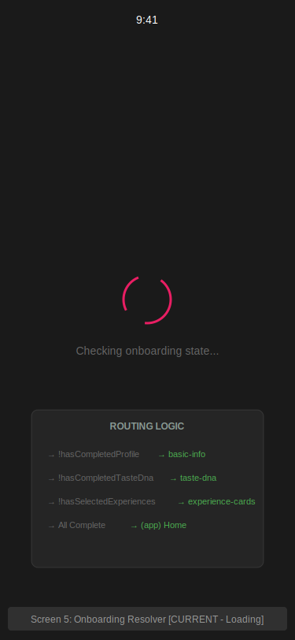

---

## Screen 6: Basic Info (Onboarding Step 1)
**Status**: ✅ CURRENT  
**Purpose**: Collect user name, photo, bio  
**Transition**: → Screen 7 (Taste DNA)

**Key Elements**:
- Title "Your Profile"
- Profile photo placeholder + "Add Photo" button
- Name input (required)
- Bio input (optional)
- Continue button

**⚠️ Issues**:
- Photo upload not implemented
- Bio not persisted to backend

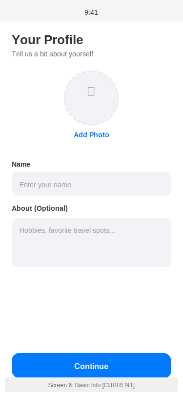

---

## Screen 7: Taste DNA (Onboarding Step 2)
**Status**: ✅ CURRENT  
**Purpose**: Collect travel preferences  
**Transition**: → Screen 8 (Experience Cards)

**Key Elements**:
- Title "Your Travel DNA"
- Travel Style selector (Fast ↔ Experience)
- Route Flexibility selector (Low/Medium/High)
- Budget Preference selector (Budget/Moderate/Premium)
- Travel Group selector (Solo/Couple/Friends/Family)
- Stop Frequency selector (Minimal/Moderate/Maximum)
- Continue button

**Persistence**: Saves to user profile on backend

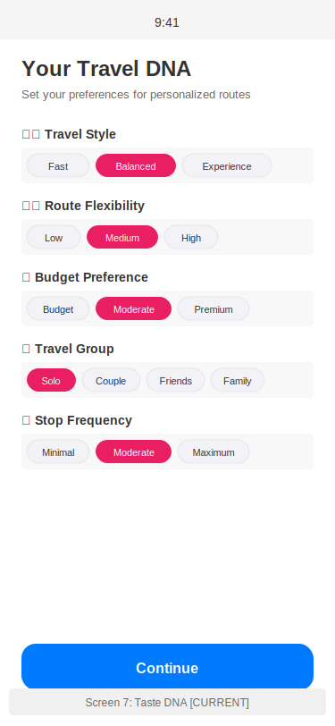

---

## Screen 8: Experience Cards (Onboarding Step 3)
**Status**: ✅ CURRENT  
**Purpose**: Select profile-level experience preferences  
**Transition**: → Screen 9 (Home) or Screen 21 (Future: Summary)

**Key Elements**:
- Step indicator "Step 2 of 2"
- Skip button
- Title + subtitle
- Counter showing selected/minimum (4 required)
- Category sections (Food & Dining, Activities, etc.)
- Experience cards grid (selectable)
- Continue button (enabled when ≥4 selected)

**Behavior**: Must select minimum 4 cards to proceed

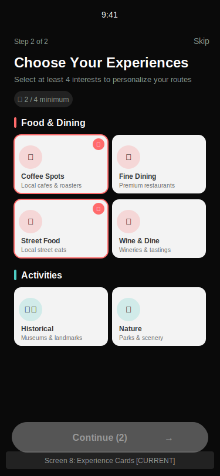

---

## Screen 9: Home / Dashboard
**Status**: ✅ CURRENT  
**Purpose**: Main entry point, route creation start  
**Transitions**:  
- → Screen 10 (Waypoints) on destination selection
- → Screen 15 (Profile) via profile button

**Key Elements**:
- Profile button (top right)
- "Where to?" title
- Destination search input
- Google Places autocomplete suggestions
- Continue button

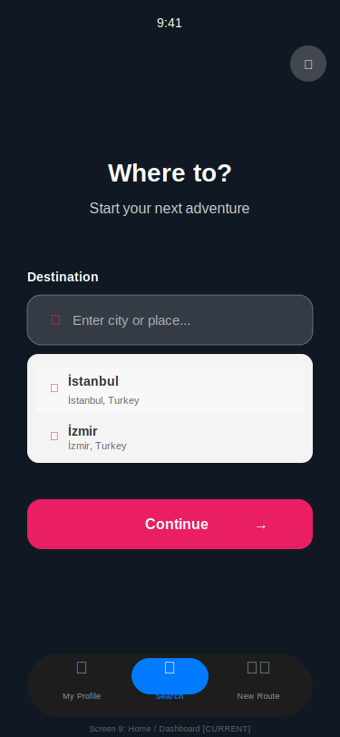

---

## Screen 10: Waypoints
**Status**: ✅ CURRENT  
**Purpose**: Add optional stops between origin and destination  
**Transition**: → Screen 11 (Route Planner)

**Key Elements**:
- Back button
- Header "Add Waypoints"
- Destination display (locked)
- Waypoint input field
- List of added waypoints (reorderable, deletable)
- Map preview
- Continue button

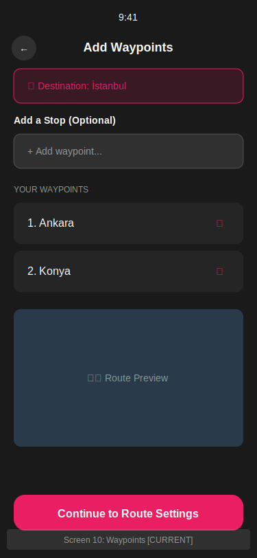

---

## Screen 11: Route Planner
**Status**: ✅ CURRENT  
**Purpose**: Configure route settings (mode, time, stops, budget)  
**Transition**: → Screen 12 (Recommendations)

**Key Elements**:
- Back button
- Header "Route Settings"
- Route summary bar
- Travel Mode selector:
  - ⚡ Pass-Through (fast)
  - 🚗 Casual (balanced)
  - 🌟 Flexible (experience-first)
- Time Limit dropdown
- Stops per Day slider
- Budget Range selector
- "Get Recommendations" button

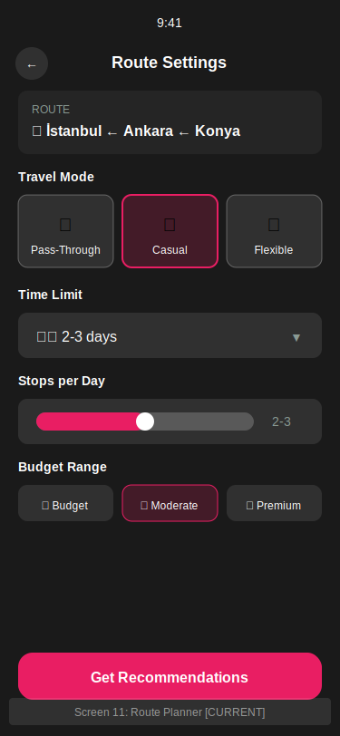

---

## Screen 12: Recommendations
**Status**: ✅ CURRENT  
**Purpose**: Display AI-generated stop recommendations  
**Transition**: → Screen 13 (Route Preview)

**Key Elements**:
- Back button
- Header "Recommended Stops"
- "Based on your Taste DNA" indicator
- Recommendation cards with:
  - Photo placeholder
  - Name, category, location
  - Rating
  - Detour time + budget indicator
  - Add/Added toggle button
  - Details button
- Stats bar (stops count, added time)
- "Preview Route" button

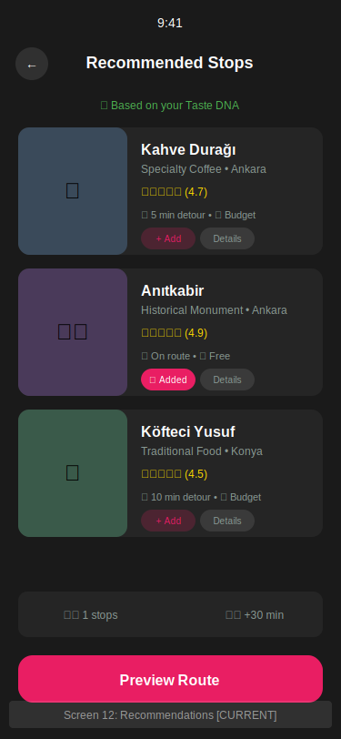

---

## Screen 13: Route Preview
**Status**: ✅ CURRENT  
**Purpose**: Review finalized route before starting  
**Transitions**:  
- → Screen 14 (Map/Navigation) on "Start Route"
- ← Screen 12 on "Edit Route"

**Key Elements**:
- Back button
- Header "Route Preview"
- Map with route path visualization
- Origin, stops, destination markers
- Route summary card (distance, duration, stops, cost)
- Planned stops list (timeline format)
- "Edit Route" button
- "Start Route" button

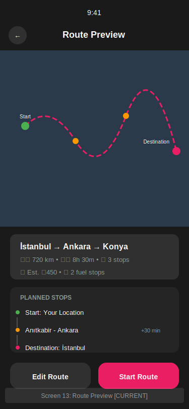

---

## Screen 14: Map / Navigation
**Status**: ✅ CURRENT  
**Purpose**: Active navigation with map view  
**Transitions**: Modal overlays for stop details

**Key Elements**:
- Full-screen map
- Route path overlay
- Current location indicator
- Stop markers (numbered)
- Destination marker
- Back button
- Recenter button
- Next stop info card
- Bottom stats bar (ETA, distance, stops remaining)

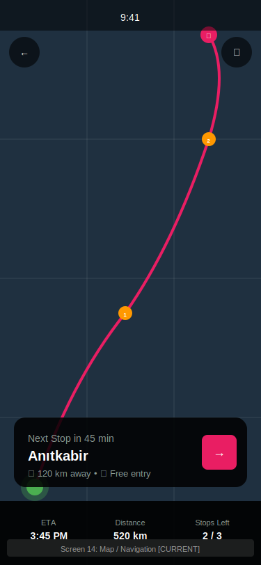

---

## Screen 15: Profile
**Status**: ✅ CURRENT  
**Purpose**: Display user profile, stats, favorites  
**Transitions**:  
- → Screen 16 (Settings)
- → Screen 20 (Future: Edit Profile)

**Key Elements**:
- Cover photo
- Back + settings buttons
- Profile photo with edit badge
- User name, username, bio
- Stats row (routes, km traveled, stops visited)
- Tab switcher (Favorites/Reviews)
- Favorites grid with place cards
- Reviews list

**⚠️ Issue**: Favorites and reviews use dummy data

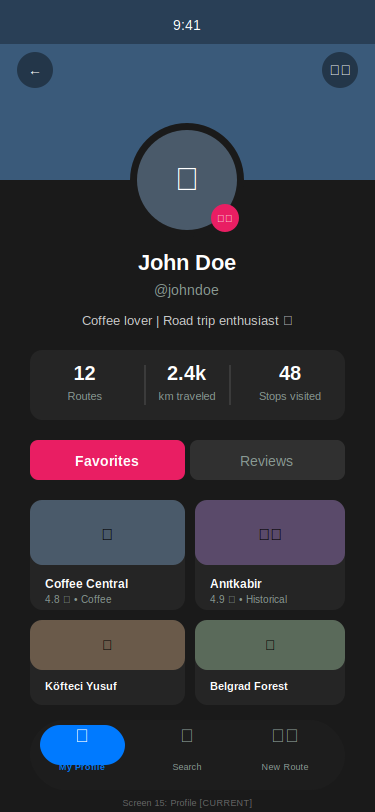

---

## Screen 16: Settings
**Status**: ✅ CURRENT  
**Purpose**: App and account settings  
**Transitions**:  
- Back to Screen 15

**Key Elements**:
- Back button
- Header "Settings"
- Account section:
  - Edit Profile
  - Update Taste DNA
  - Experience Cards
- App Settings section:
  - Language (with current selection)
  - Notifications toggle
  - Dark Mode toggle
- Support section:
  - Help & FAQ
  - Terms of Service
- Logout button (danger zone)

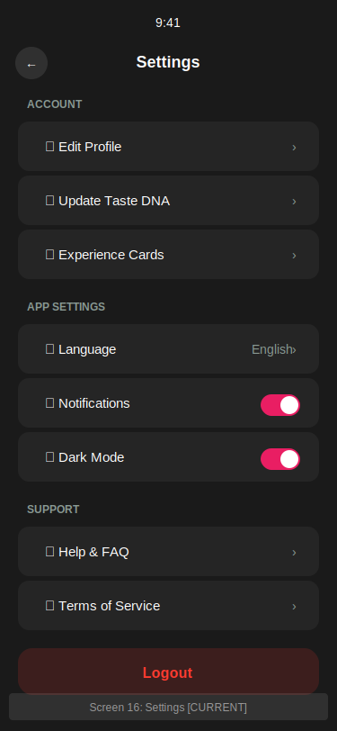

---

# 3. Future/Planned Screens

## Screen 17: Discover
**Status**: 🟠 FUTURE  
**Purpose**: Browse places, experiences, community routes  
**Navigation**: Bottom tab "Discover"

**Key Elements**:
- Search bar with filters
- Filter pills (All, Coffee, Food, History, etc.)
- "Trending Near You" section with horizontal cards
- "Community Routes" section with route cards
- Bottom tab bar

**Rationale**: Core feature per product vision - discovery and exploration

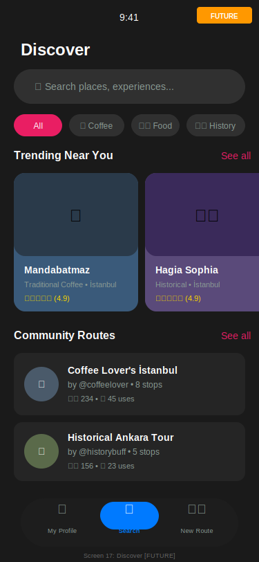

---

## Screen 18: My Routes
**Status**: 🟠 FUTURE  
**Purpose**: Central hub for saved, in-progress, and completed routes  
**Navigation**: Bottom tab "Routes"

**Key Elements**:
- Filter tabs (All, Saved, Completed)
- Route cards with status badges:
  - IN PROGRESS (green)
  - SAVED (blue)
  - COMPLETED (gray)
- Route details (via, distance, stops, date)
- Continue/View actions
- Create route FAB
- Bottom tab bar

**Rationale**: Users need easy access to their route history

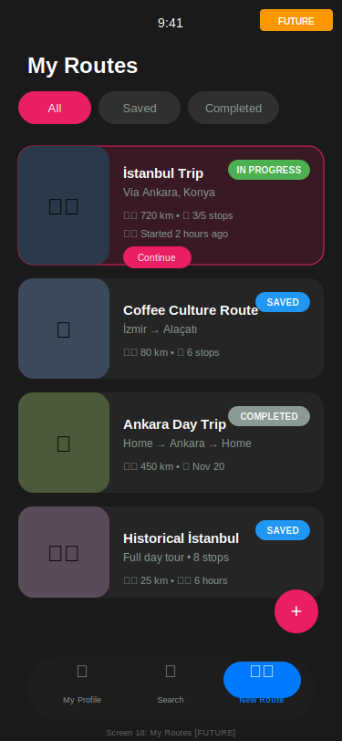

---

## Screen 19: Route Experience Cards
**Status**: 🟠 FUTURE  
**Purpose**: Customize experience cards for a specific route  
**Access**: During route creation (between Screen 11 and 12)

**Key Elements**:
- Header "Route Experience Cards"
- Explanation banner
- "Use Profile Defaults" toggle
- Selected cards section (with checkmarks)
- Available cards section (tap to add)
- "Apply to Route" button

**Rationale**: Critical for route-level personalization (per product vision)

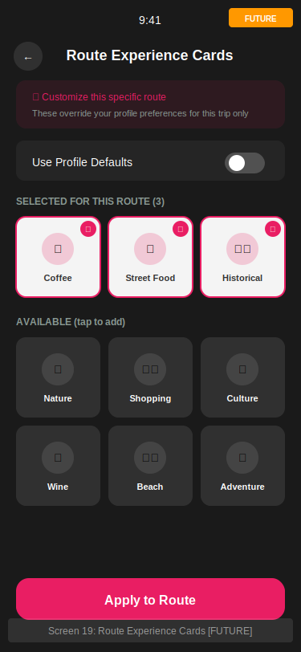

---

## Screen 20: Edit Profile
**Status**: 🟠 FUTURE  
**Purpose**: Full profile editing functionality  
**Access**: From Screen 15 (Profile) or Screen 16 (Settings)

**Key Elements**:
- Back + Save buttons
- Profile photo with camera badge
- Form fields:
  - Name
  - Username
  - Bio (with character count)
  - Email (verified status)
- Danger zone: Delete Account

**Rationale**: Currently only a placeholder in profile.tsx

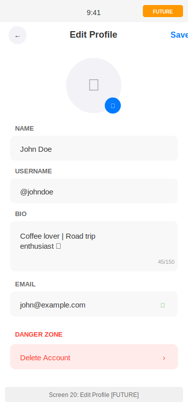

---

## Screen 21: Profile Summary
**Status**: 🟠 FUTURE  
**Purpose**: Confirmation screen after onboarding completion  
**Position**: Between Screen 8 and Screen 9

**Key Elements**:
- Header "Profile Summary"
- Profile card preview
- "Your Travel DNA" summary
- "Your Experience Cards" preview
- Success message
- "Start Exploring" CTA

**Rationale**: Gives users a chance to review and edit before entering app

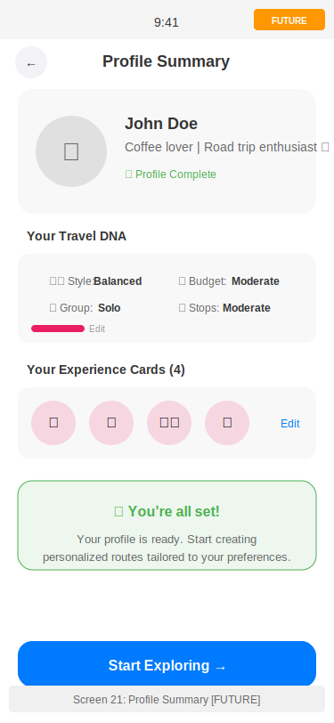

---

# 4. Screen Relationship Matrix

| From Screen | To Screen(s) | Condition | UI Element |
|-------------|--------------|-----------|------------|
| 1 Splash | 2 or 9 | First launch vs returning | Auto |
| 2 Language | 3 | Selection made | Language card tap |
| 3 Login | 4, 5 | Register link / Success | Link / Button |
| 4 Register | 3, 5 | Login link / Success | Link / Button |
| 5 Resolver | 6, 7, 8, 9 | Based on completion state | Auto |
| 6 Basic Info | 7 | Continue | Button |
| 7 Taste DNA | 8 | Continue | Button |
| 8 Exp Cards | 9 (or 21) | ≥4 cards selected | Button |
| 9 Home | 10, 15 | Destination / Profile | Input / Button |
| 10 Waypoints | 11 | Continue | Button |
| 11 Route Planner | 12 (via 19) | Get Recommendations | Button |
| 12 Recommendations | 13 | Preview Route | Button |
| 13 Route Preview | 14, 12 | Start / Edit | Buttons |
| 14 Map | - | Modal overlays | - |
| 15 Profile | 16, 20 | Settings / Edit | Buttons |
| 16 Settings | 15, 6, 7, 8 | Back / Subsections | Links |

---

# 5. Implementation Status

## Current Implementation (16 screens)

| # | Screen | Status | Priority Issues |
|---|--------|--------|-----------------|
| 1 | Splash | ✅ Complete | - |
| 2 | Language Selection | ✅ Complete | - |
| 3 | Login | ✅ Complete | - |
| 4 | Register | ⚠️ Partial | Social login bypasses onboarding |
| 5 | Onboarding Resolver | ✅ Complete | - |
| 6 | Basic Info | ⚠️ Partial | Photo upload missing, bio not saved |
| 7 | Taste DNA | ✅ Complete | - |
| 8 | Experience Cards | ✅ Complete | - |
| 9 | Home | ✅ Complete | Tab bar disabled |
| 10 | Waypoints | ✅ Complete | - |
| 11 | Route Planner | ✅ Complete | - |
| 12 | Recommendations | ✅ Complete | - |
| 13 | Route Preview | ✅ Complete | - |
| 14 | Map | ✅ Complete | - |
| 15 | Profile | ⚠️ Partial | Dummy data, edit not working |
| 16 | Settings | ✅ Complete | - |

## Future Implementation (5 screens)

| # | Screen | Priority | Dependency |
|---|--------|----------|------------|
| 17 | Discover | High | Bottom tab bar |
| 18 | My Routes | High | Route persistence |
| 19 | Route Exp Cards | Medium | Route creation flow |
| 20 | Edit Profile | Medium | Profile backend |
| 21 | Profile Summary | Low | Onboarding polish |

---

## Critical Fixes Required

1. **Enable Bottom Tab Bar** - Currently returns null in `(app)/_layout.tsx`
2. **Fix Social Login Routing** - Must go through onboarding resolver
3. **Persist Bio in Basic Info** - Currently discarded
4. **Implement Profile Photo Upload** - End-to-end with backend
5. **Create Edit Profile Screen** - Replace placeholder alert

---

*Document generated: February 7, 2025*  
*All mockups in SVG format at: `docs/mockups/`*
